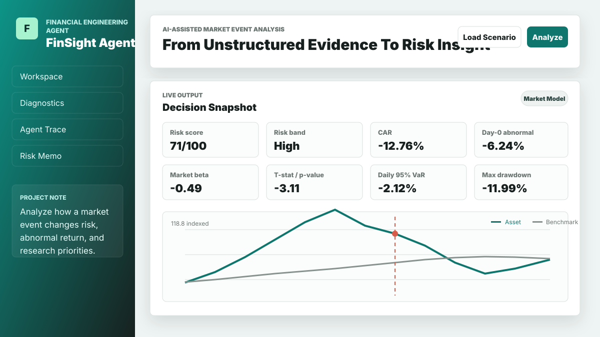
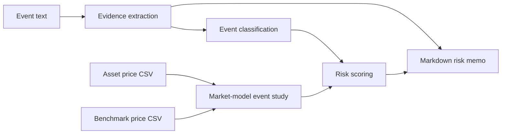

# FinSight Agent

> AI-assisted financial event risk analysis with evidence extraction, market-model event study diagnostics, and traceable memo generation.

[](https://github.com/r3277795257-dot/finsight-agent/actions/workflows/pages.yml)
[](https://www.typescriptlang.org/)
[](LICENSE)
[](#quick-start)

FinSight Agent turns unstructured market text and price data into a structured risk memo. It is designed for cases where a financial event is messy: management guidance is positive, margins are under pressure, the stock reacts sharply, and the analyst needs to separate narrative from measurable market impact.



## What It Does

- Extracts evidence snippets and numeric claims from news, announcements, transcripts, or research notes.
- Classifies event types such as supply-chain pressure, regulation, credit risk, earnings, capital allocation, liquidity, and AI productivity.
- Estimates a market model against a benchmark series.
- Calculates day-0 abnormal return, cumulative abnormal return, beta, approximate t-statistic, and p-value.
- Computes practical risk diagnostics including historical VaR, expected shortfall, max drawdown, realized volatility, and volatility regime change.
- Produces an exportable Markdown memo with evidence, diagnostics, monitoring questions, and a research disclaimer.

## Live Demo

GitHub Pages URL:

```text
https://r3277795257-dot.github.io/finsight-agent/
```

If the page is not live yet, enable GitHub Pages with `Settings -> Pages -> Source -> GitHub Actions`.

## Why This Exists

Most financial event workflows split into two weak pieces: qualitative notes in one place and price diagnostics somewhere else. FinSight Agent joins them into one traceable loop:



The first version is deterministic rather than black-box. That makes the output inspectable, testable, and easy to extend with a server-side LLM adapter later.

## Quick Start

Clone and install:

```bash
git clone https://github.com/r3277795257-dot/finsight-agent.git
cd finsight-agent
npm install
```

Run tests and build:

```bash
npm run check
```

Start the local static server:

```bash
npm start
```

Open:

```text
http://127.0.0.1:4173
```

## CSV Format

Asset and benchmark price files use the same simple schema:

```csv
date,close
2026-07-14,44.2
2026-07-15,43.6
2026-07-16,41.2
```

The first column is treated as the date. The final column is treated as the close price, which keeps the parser compatible with simple exported spreadsheets.

## Methodology

The market model is estimated from pre-event aligned asset and benchmark returns:

```text
asset_return[t] = alpha + beta * benchmark_return[t] + residual[t]
```

For the event window:

```text
abnormal_return[t] = asset_return[t] - (alpha + beta * benchmark_return[t])
CAR = sum(abnormal_return[t])
```

The app also computes historical 95% VaR, expected shortfall, maximum drawdown, annualized realized volatility, pre/post-event volatility, and downside hit rate. See [docs/methodology.md](docs/methodology.md) for details.

## Project Structure

```text
.
|-- index.html
|-- styles.css
|-- src/
|   |-- agent.ts
|   |-- finance.ts
|   |-- main.ts
|   |-- nlp.ts
|   |-- report.ts
|   |-- scenarios.ts
|   `-- types.ts
|-- tests/
|   |-- agent.test.ts
|   `-- finance.test.ts
|-- data/
|   |-- sample-news.txt
|   |-- sample-prices.csv
|   `-- sample-benchmark.csv
|-- docs/
|   |-- methodology.md
|   |-- product-decisions.md
|   `-- screenshot.svg
`-- .github/workflows/pages.yml
```

## Built-In Scenarios

- EV supply-chain margin pressure
- Internet platform regulation
- Bank credit risk update

Each scenario includes source text, asset prices, benchmark prices, and an event date so the workflow can be reviewed immediately after launch.

## Design Principles

- **Traceability first:** every memo links back to evidence snippets and intermediate diagnostics.
- **Financial engineering over decoration:** the core value is event-study logic, not a generic sentiment score.
- **Browser-first demo:** no backend is required for review or GitHub Pages deployment.
- **Extensible boundary:** `src/agent.ts` coordinates the workflow, while finance, NLP, and report generation stay separable.

## Roadmap

- Add a server-side LLM adapter with JSON schema validation for richer evidence extraction.
- Connect a market data provider for live prices and benchmark selection.
- Add PDF ingestion for annual reports and earnings-call transcripts.
- Add portfolio-level exposure aggregation and stress testing.
- Build an evaluation set of historical events to benchmark classification and memo quality.

## Disclaimer

FinSight Agent is for research, education, and product demonstration only. It is not investment advice.
